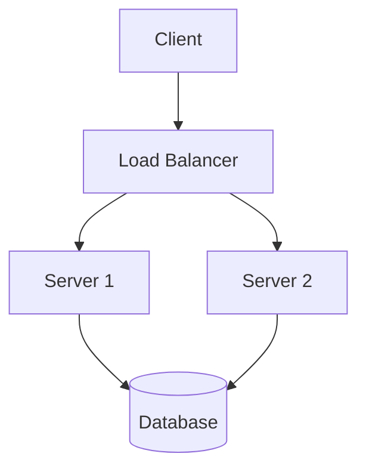

This is a placeholder post for your system design notes.

## Example Architecture
Here is a very simple diagram:



## Example Code
Here is some highlighted code:

```python
def consistent_hash(key, num_buckets):
    # This ensures smooth scaling
    return hash(key) % num_buckets
```
